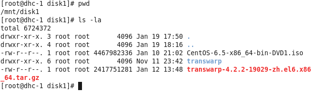
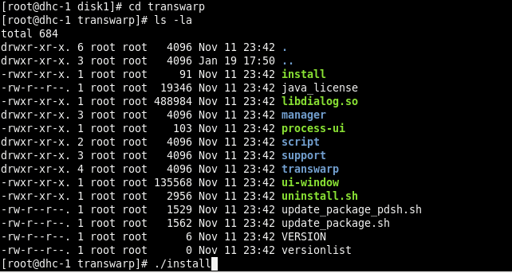
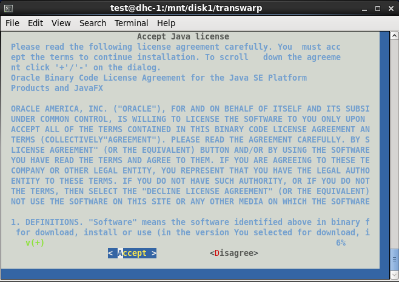
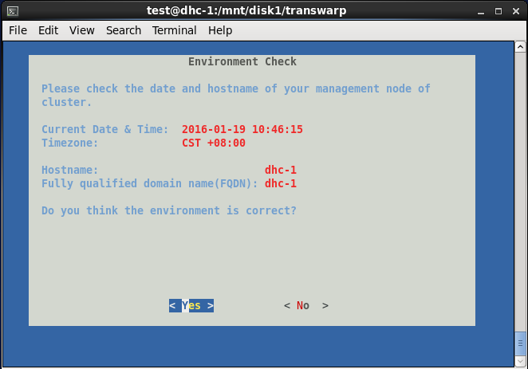
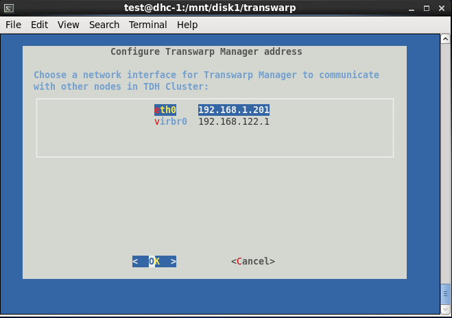
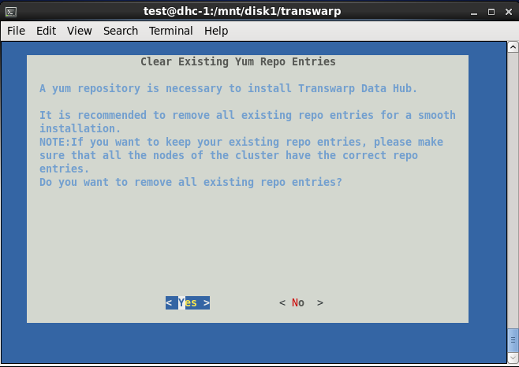
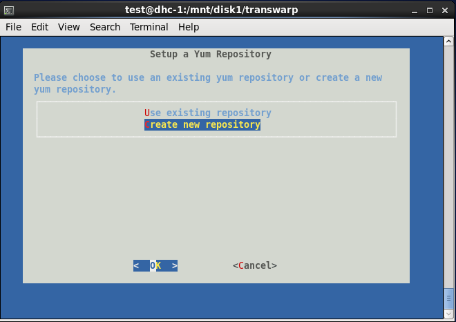
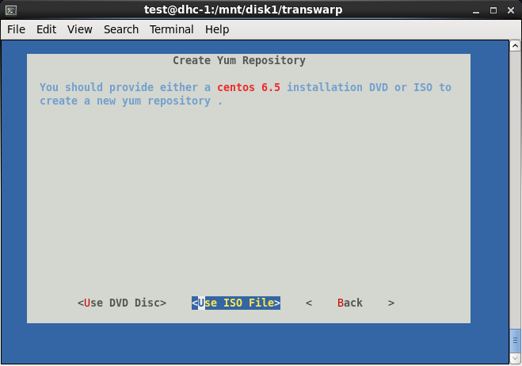
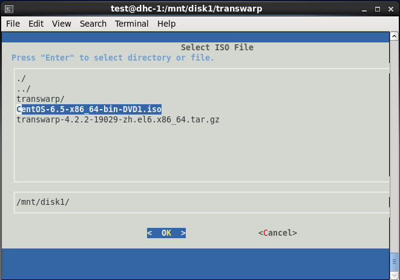

# 第一章 TDH安装步骤


##安装前准备

a、将linux主机的IP设置成静态IP，如192.168.1.200

b、在/etc/hosts文件中添加主机名，添加在最后一行，如192.168.1.200 dhc-1(注意hostname不支持使用'_'、'.')

c、使用chkconfig iptables off关闭防火墙

d、在/mnt目录中创建disk1目录

e、设置系统时间为NTP网络时间(如date -s '2016-1-19 9:00:00')


##Transwarp Manager的安装：

1、进入/mnt/disk1目录


   
 
 
 
 2、解压其中的transwarp安装包并安装
 ```
 >tar -zxvf transwarp-4.2.2-19029-zh.el6.x86_64.tar.gz
 >cd transwarp
 >./install
 
 ```
 
 
 3、安装完成后，会自动弹出界面，依次选择Accept→选择网卡→默认端口8180→删除已有yum资源库→create new repository→Use ISO File→选择/mnt/disk1中的CentOS6.5安装包
 
 
 
 
 
 
 
 
 
 
 
 
 4、安装好Centos6.5以后，打开chrome浏览器，输入安装Manager的本地节点ip地址加端口号8180，如192.168.1.200：8180，进行如下步骤操作：
 
（1）、输入admin、admin进入界面

（2）、填写集群名称（随意取名）

（3）、添加机柜（使用/rack1，/rack2......）指定

（4）、添加节点（可以使用［］来批量添加，如172.16.2.［68-70］）

（5）、输入root账号和密码进行确认设定

（6）、分配机柜，将刚刚的第一个节点分配到/rack1中，其他两个节点分配到/rack2中

（7）、选择需要/etc/hosts来确认网络解析

（8）、为了负载均衡，将YARN分配到/rack1中，Inceptor－server分配到/rack2中

5、安装组件和服务，按照左侧栏提示分别需要安装Zookeeper、HDFS、YARN、
Hyperbase、Inceptor－SQL，其他可以暂时不用安装

（1）Zookeeper：将全部节点都添加上（一定要为奇数），其他默认
HDFS：记住两个重要目录即可，分别为dfs.namenode.name.dir和dfs.datanode.data.dir，其他默认配置

（2）YARN：基础参数中配置yarn.nodemanager.resource.cpu-vcores的CPU核数，配置yarn.nodemanager.resource.memory-mb的内存大小，推荐配置为YARN的核数全给，内存给一半

（3）HyperBase：配置master.memory内存大小，（若内存大小为8G，那么这里就应该是8G-YARN的                                 yarn.nodemanager.resource.memory-mb内存大小），Mastermemory相当于NN，Region server类似于DN，一般Master memory不耗费内存，主要Region server比较耗费内存

（4）Inceptor-SQL(SQL on spark)：
高级参数里面可以设置安全护栏，即hive.server.enable，值为FALSE不开启，值为                        TRUE后面服务就需要安装kerbos认证了，这项看具体实际需求。另外在资源分配选项中，executor有                                   Fixed（同构机器，每台机器配置差不多）和Ratio（异构机器，每台机器配置相差很大）两种，一般选择Fixed，下  
面的内核和内存千万不能超过YARN所设置的内核数和内存大小的值，因为Inceptor-SQL是从YARN那里申请                    资源的！推荐配置为内核数：内存＝1:2（1个内核配置2GB）

6、确认安装后，在CLI下输入hive2登陆Inceptor的命令：

```
beeline -u jdbc:hive2://<Inceptor ip>:10000/  
```

（弃用没加安全认证的hive1登陆命令为：transwarp -t -h <Inceptor ip>

7、操作数据库
```
>show databases;
>use database;
>show tables;
>create table country(id int, name string);
```


 
 