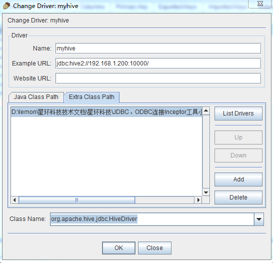

# 使用JDBC、ODBC工具连接Inceptor

##一、squirrel工具
介绍：是一个用Java编写的开源数据库工具，可以用来查看/编辑数据库的内容、发出SQL 命令。它可以支持兼容JDBC的数据库，可以使用统一的界面处理不同的数据库，本例为使用小松鼠连接Inceptor

###安装步骤：
1、确认windows系统的电脑上安装了jdk1.7或以上

2、打开CMD，输入
```
java -jar squirrel-sql-3.6-standard.jar
```
（待安装好后进入windows安装目录下运行squirrel-sql.bat）

3、连接数据库需要填写驱动信息，Name：myhive（随意起名）
URL：jdbc:hive2://<Inceptor server IP>:10000/ (/后面不写数据库名代表默认的default数据库)最后添加外部JDBC的jar包，将inceptor-driver-4.2.2.jar添加进去





4、完成安装


##二、Tableau工具
1、在官网上下载Tableau软件

2、创建ODBC

3、使用远程来添加一个数据源，例如：

    Data source Name：tdh
    Description：tdh
    Host：172.16.2.78
    Port：10000
    database：default
    Hive Server Type：Hive server2