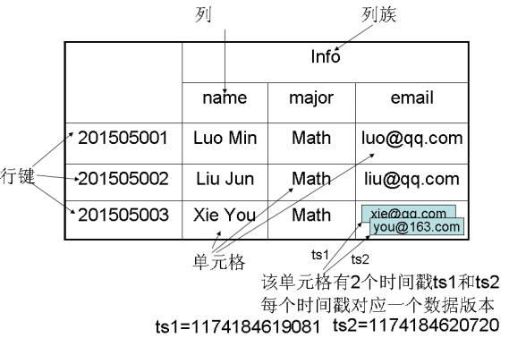
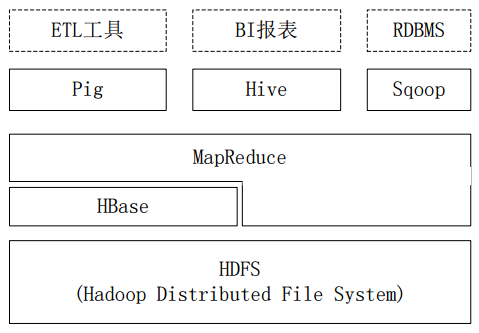

# 第六章：HBase

HBase是一个分布式、面向列的，并且适合于非结构化数据存储的数据库且没有数据库名的概念，只有表的概念，所有数据都是混杂的放在一起的。


## 1、HBase and RDBMS？

###1.1、基于列式存储
HBase采用列式存储，由于每一列的数据类型都是相似或相近的，压缩率就很高，比如之前Inceptor中分区的概念，把年龄这一列进行分区归类，从而达到压缩数据的目的。

为什么要这么做呢？因为HBase就是用来存储大量数据的，以往我们要求关系型数据库一定要遵从数据的完整性、一致性和可用性，但是考虑到在非常庞大数据面前，丢失一点数据是微不足道的，而且大数据只要是对数据进行分析，而不是进行具体字段值的返回和调用。

###1.2、存储格式
以往的RDBMS的存储格式就是为简单的行列式，是基于行和列的二维表格，通过行列两个属性就可以定位到一个具体的值。而HBase则是通过下图的4维属性来定位一个值的：




行键（row key）：HBase只能通过row key来进行单条数据的查询，而星环科技的Hyperbase可以通过非主键进行查询

列簇：包含了多个列的总称

列：每个字段的名称

单元格：每个单元格里都会有若干条具体数据，一个单元格中可能包含多个版本的数据，这些版本是通过ts1、ts2这些时间戳去定位的

总结来说，HBase是包含了行键、列簇、列、和时间戳这四个属性去定位具体一个值的


##2、HBase and Hive？

###2.1、HBase和Hive联系与区别

星环的Inceptor-SQL就是将开源的Hive进行了二次开发，主要增加了JDBC、ODBC和对SQL-2003解释器的强大功能，那么和HBase有什么区别和联系呢？

这里我大致的将各个关系进行映射，大家就可以明白了

```
Inceptor-SQL ————> Hive(Spark)
Hyperbase    ————> HBase
```


再看下面这张图




Hive的那些SQL操作底层实际上都是一个个MapReduce或者Spark任务，也就是说，Hive可以访问HDFS上的数据做数据分析，也可以对HBase做数据分析，因为真正的数据要么存放在HDFS分布式文件系统上，要么存放在HBase数据库上。


###2.2、HBase实例及代码解释

要想使用HBase存取数据必须要有两个步骤：

1、建立HBase表

```
create 'test','info'
put 'test1','101','info:name','wang'
put 'test1','101','info:sex','female'

put 'test2','102','info:name','zhang'
put 'test2','102','info:sex','male'

get 'test','101'
```


上面创建了一个HBase的test表，用于HBase和数据库做映射使用，同时往这个表里put了两行数据，分别是101和102（row key），info代表列簇，包含了name和sex两列的值

2、建立HBase外表

```
create external table hbase_test(id string, name string,sex string)
stored by 'org.apache.hadoop.hive.hbase.HBaseStorageHandler'
with serdeproperties('hbase.columns.mapping'=':key,info:name,info:sex') tblproperties('hbase.table.name'='test');
```


上述建立了一张外表，stored by制定HBase的存储格式，with后面是序列化和反序列化，作用是进行map映射，从上面的语句可以看出，将id映射成了key、将name、和sex映射成了info（列簇）


